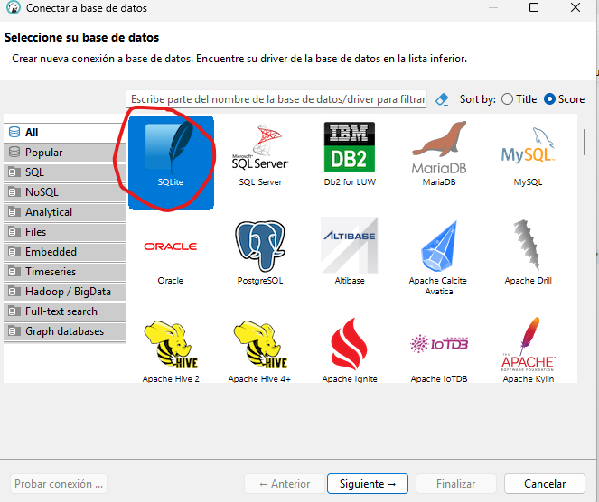
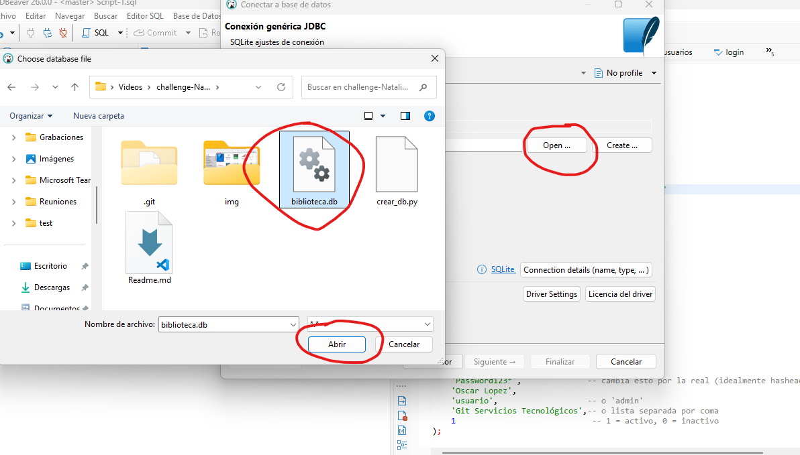

# Reto de Bases de Datos – SQLite

Este reto consiste en ejecutar un script en Python que crea una base de datos y varias tablas.  
Después podrás abrir la base en DBeaver y resolver consultas SQL.

---

# 1. Requisitos

Debes tener instalado:

- Python (versión 3.8 o superior)
- DBeaver
- SQLite

Normalmente SQLite ya viene incluido con Python, así que no necesitas instalarlo aparte.

---

# 2. Instalación

## Instalar Python

Descargar desde:

https://www.python.org/downloads/

Durante la instalación marcar la opción:

# 3. paso 1 

# 3. paso 2

# 3. paso 3

Buscar la ruta de donde genero la base de datos el archivo de python

Cuando ya se tenga seleccionada hacer clic en finalizar

# 4. paso 
Una vez creada la base de datos y abiertas las tablas en DBeaver, debes resolver los siguientes retos usando SQL.

No modifiques la estructura de las tablas. Solo puedes usar consultas SQL.

---

# Nivel 1 — Básico

1. Inserta **3 autores** en la tabla `autores`.

2. Inserta **5 libros** en la tabla `libros` y asígnales un autor usando `autor_id`.

3. Inserta **2 usuarios** en la tabla `usuarios`.

---

# Nivel 2 — Intermedio

4. Registra **2 préstamos** en la tabla `prestamos`.