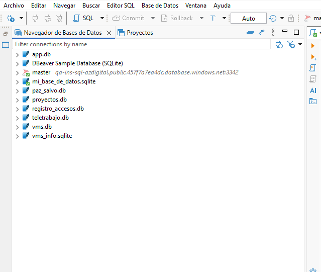

# Reto de Bases de Datos – SQLite

Este reto consiste en ejecutar un script en Python que crea una base de datos y varias tablas.  
Después podrás abrir la base en DBeaver y resolver consultas SQL.

---

# 1. Requisitos

Debes tener instalado:

- Python (versión 3.8 o superior)
- DBeaver
- SQLite

Normalmente SQLite ya viene incluido con Python, así que no necesitas instalarlo aparte.

---

# 2. Instalación

## Instalar Python

Descargar desde:

https://www.python.org/downloads/

Durante la instalación marcar la opción:

# 3. paso 1 

